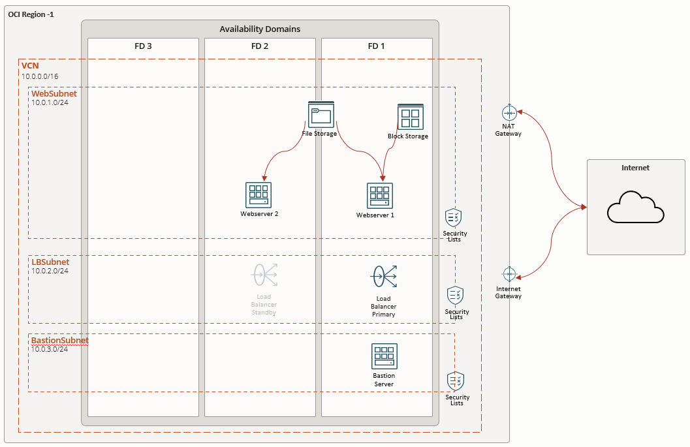

# Terraform en OCI

## Despliegue de Infraestructura en OCI

Este proyecto implementa una infraestructura completa en Oracle Cloud Infrastructure (OCI) utilizando Terraform.

### Recursos a Desplegar

1. **Compartimento**: Organización lógica para todos los recursos del proyecto.
2. **VCN (Virtual Cloud Network)**:
   - Red virtual con CIDR personalizable
   - Configuración de DNS automática

3. **Subredes**:
   - Subred Web (privada) con CIDR configurable
   - Subred LoadBalancer (pública) con CIDR configurable
   - Subred Bastion (pública) con CIDR configurable
   - Subred FSS (privada) con CIDR configurable

4. **Componentes de Red**:
   - Internet Gateway para acceso público
   - NAT Gateway para acceso a internet desde subredes privadas
   - Tabla de rutas con ruta predeterminada al Internet Gateway y NAT Gateway
   - Listas de seguridad para puertos 22 (SSH), 80 (HTTP), 443 (HTTPS)

5. **Servidores Web**:
   - **Servidor Web 1** (FD1):
     - Instancia de computación con IP privada
     - Apache preinstalado
     - Página web personalizada
     - Block Volume de 100GB adjunto

   - **Servidor Web 2** (FD2):
     - Instancia de computación con IP privada
     - Apache preinstalado
     - Página web personalizada

6. **Balanceador de Carga**:
   - Balanceador de carga público
   - Configuración flexible de ancho de banda
   - Reglas de salud para backend

7. **Bastion Host**:
   - Instancia de computación para acceso seguro
   - Configuración de SSH

8. **File Storage (FSS)**:
   - Sistema de archivos compartido
   - Montaje automático en ambos servidores web
   - Configuración de exportación y permisos

9. **Block Volume**:
   - Volumen de bloque de 100 GB
   - Adjuntado al Servidor Web 1
   - Montaje automático en /u01

10. **Aprovisionamiento**:
    - Instalación automática de Apache
    - Configuración de firewall
    - Despliegue de contenido web personalizado

### Despliegue Usando Oracle Resource Manager

1. Haga clic en el siguiente botón para desplegar:

    

2. Proceso de Despliegue:
   - Inicie sesión con sus credenciales de OCI
   - Acepte los términos y condiciones
   - Seleccione la región objetivo
   - Complete la configuración del stack

3. Ejecución:
   - En la página del stack, seleccione "Terraform Actions"
   - Ejecute "Plan" para revisar los cambios
   - Si el plan es correcto, ejecute "Apply"

### Verificación del Despliegue

1. Acceda a la consola de OCI
2. Verifique las instancias creadas en diferentes FDs
3. Pruebe el acceso web a ambos servidores usando sus IPs privadas

### Listas de Seguridad

1. **Lista de Seguridad Web**:
   - Reglas de salida para permitir todo el tráfico saliente
   - Reglas de entrada para permitir tráfico en los puertos 80 (HTTP) y 443 (HTTPS)

2. **Lista de Seguridad SSH**:
   - Reglas de salida para permitir todo el tráfico saliente
   - Reglas de entrada para permitir tráfico en el puerto 22 (SSH)

3. **Lista de Seguridad FSS**:
   - Reglas de entrada y salida para permitir tráfico en los puertos necesarios para el servicio de archivos compartidos (FSS)

### Recursos Adicionales

- [Documentación de Terraform para OCI](https://registry.terraform.io/providers/oracle/oci/latest/docs)
- [Documentación de Oracle Cloud Infrastructure](https://docs.oracle.com/iaas/Content/home.htm)