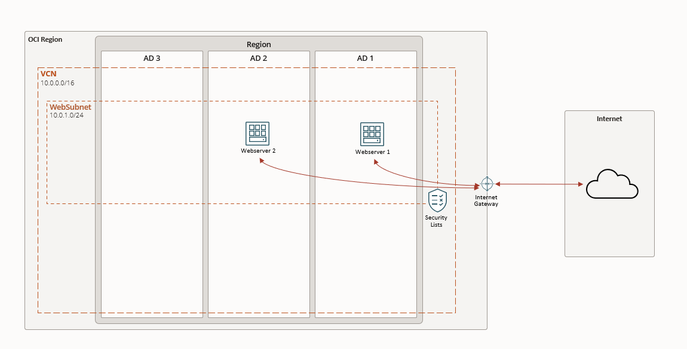

# Terraform en OCI

## Despliegue de Servidores Web en Múltiples Dominios de Disponibilidad

Este proyecto implementa dos servidores web ubicados en diferentes Dominios de Disponibilidad (AD).

### Recursos a Desplegar

1. **Compartimento**: Organización lógica para todos los recursos del proyecto.
2. **VCN (Virtual Cloud Network)**:
   - Red virtual con CIDR personalizable
   - Configuración de DNS automática
   
3. **Subred Pública Regional**:
   - Abarca múltiples ADs
   - Permite asignación de IPs públicas
   - CIDR configurable

4. **Componentes de Red**:
   - Internet Gateway para acceso público
   - Tabla de rutas con ruta predeterminada al Internet Gateway
   - Lista de seguridad con reglas para puertos 22 (SSH), 80 (HTTP), 443 (HTTPS)

5. **Servidores Web**:
   - **Servidor Web 1** (AD1):
     - Instancia de computación con IP pública
     - Apache preinstalado
     - Página web personalizada
   
   - **Servidor Web 2** (AD2):
     - Instancia de computación con IP pública
     - Apache preinstalado
     - Página web personalizada

6. **Aprovisionamiento**:
   - Instalación automática de Apache
   - Configuración de firewall
   - Despliegue de contenido web personalizado

### Despliegue Usando Oracle Resource Manager

1. Haga clic en el siguiente botón para desplegar:

    

2. Proceso de Despliegue:
   - Inicie sesión con sus credenciales de OCI
   - Acepte los términos y condiciones
   - Seleccione la región objetivo
   - Complete la configuración del stack

3. Ejecución:
   - En la página del stack, seleccione "Terraform Actions"
   - Ejecute "Plan" para revisar los cambios
   - Si el plan es correcto, ejecute "Apply"

### Verificación del Despliegue

1. Acceda a la consola de OCI
2. Verifique las instancias creadas en diferentes ADs
3. Pruebe el acceso web a ambos servidores usando sus IPs públicas

### Consideraciones de Producción

- Considere agregar un balanceador de carga
- Implemente monitoreo y alertas
- Configure copias de seguridad
- Establezca políticas de escalado

### Recursos Adicionales

- [Documentación de Terraform para OCI](https://registry.terraform.io/providers/oracle/oci/latest/docs)
- [Documentación de Oracle Cloud Infrastructure](https://docs.oracle.com/iaas/Content/home.htm)