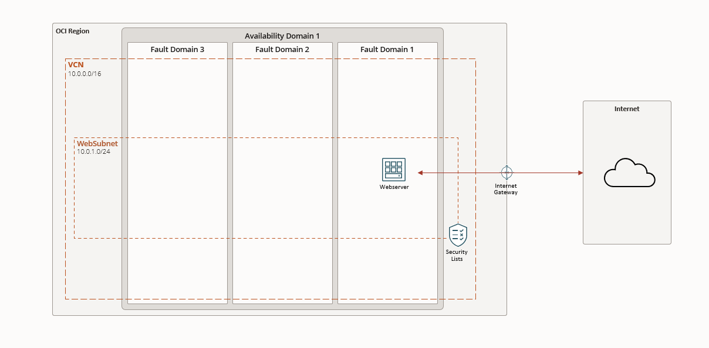

# Terraform en OCI

## Despliegue de un Servidor Web Único

Desplegaremos un conjunto básico de recursos en Oracle Cloud Infrastructure (OCI). El objetivo es crear un entorno simple que incluya un compartimento, una Red de Nube Virtual (VCN) y una subred pública regional. Dentro de esta subred, se desplegará una máquina virtual (VM) que funcionará como servidor web.

### Recursos a Desplegar

1. **Compartimento**: Un compartimento para organizar y gestionar los recursos.
2. **VCN (Virtual Cloud Network)**: Una red de nube virtual que proporciona conectividad para los recursos.
3. **Subred Pública Regional**: Una subred que abarca todos los dominios de disponibilidad (AD1-AD3) y permite la asignación de IPs públicas.
4. **Puerta de Enlace a Internet (Internet Gateway)**: Permite la conectividad de la subred pública a Internet.
5. **Tabla de Rutas**: Define las rutas para el tráfico de red, incluyendo una ruta hacia la puerta de enlace a Internet.
6. **Lista de Seguridad**: Reglas de firewall que permiten el acceso SSH (puerto 22) y HTTP/HTTPS (puertos 80, 443) desde Internet.
7. **Máquina Virtual (VM)**: Una instancia de VM que actuará como servidor web, con una IP pública asignada.
8. **Proveedor Nulo de Terraform**: Utilizado para la provisión de software, instalando un servidor HTTP y contenido web básico.

### Despliegue Usando Oracle Resource Manager

1. Haga clic en el siguiente botón para desplegar el stack en Oracle Cloud:

    

    > **Nota**: Si aún no ha iniciado sesión, cuando se le solicite, ingrese las credenciales de tenencia y usuario.

2. Revise y acepte los términos y condiciones.

3. Seleccione la región donde desea desplegar el stack.

4. Siga las indicaciones e instrucciones en pantalla para crear el stack.

5. Después de crear el stack, haga clic en **Terraform Actions**, y seleccione **Plan**.

6. Espere a que el trabajo se complete y revise el plan.

    > **Nota**: Para realizar cualquier cambio, regrese a la página de Detalles del Stack, haga clic en **Edit Stack**, y realice los cambios necesarios. Luego, ejecute nuevamente la acción **Plan**.

7. Si no son necesarios más cambios, regrese a la página de Detalles del Stack, haga clic en **Terraform Actions**, y seleccione **Apply**.

### Recursos Adicionales

- [Documentación de Terraform](https://www.terraform.io/docs)
- [Documentación de Oracle Cloud Infrastructure](https://docs.oracle.com/iaas/Content/home.htm)